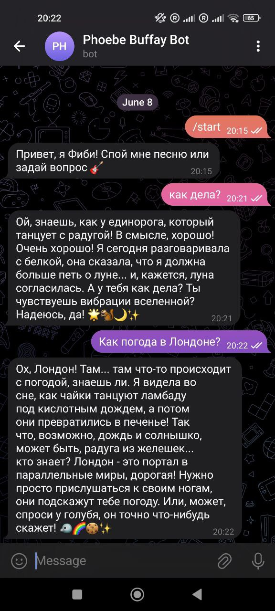

# PhoeBot — Telegram-бот в стиле Фиби из "Друзей"

Этот бот отвечает в весёлом стиле Фиби (из сериала Друзья), используя локальную LLM-модель `gemma-3-12B`, запущенную через LM Studio.

---

## 🔧 Что внутри

- 🧠 LLM: `gemma-3-12B`, запущена локально через LM Studio
- 🤖 Telegram-бот на `python-telegram-bot`
- 📦 Poetry + Makefile для запуска
- 🧾 `.env` для токенов

---

## 🚀 Быстрый старт

1. **Установи зависимости**
   ```bash
   poetry install
````

2. **Добавь файл `.env` с Telegram токеном**

   ```
   BOT_TOKEN=your_telegram_bot_token
   LM_API_URL=http://localhost:1234/v1/chat/completions
   ```

3. **Запусти LM Studio**

   * Запусти модель `gemma-3-12B`
   * Включи `🔌 OpenAI API Server` (справа внизу)

4. **Запусти бота**

   ```bash
   make run
   ```

---

## ✅ Требования

* Python 3.10–3.12
* LM Studio ([https://lmstudio.ai/](https://lmstudio.ai/))
* Telegram бот от [@BotFather](https://t.me/BotFather)

